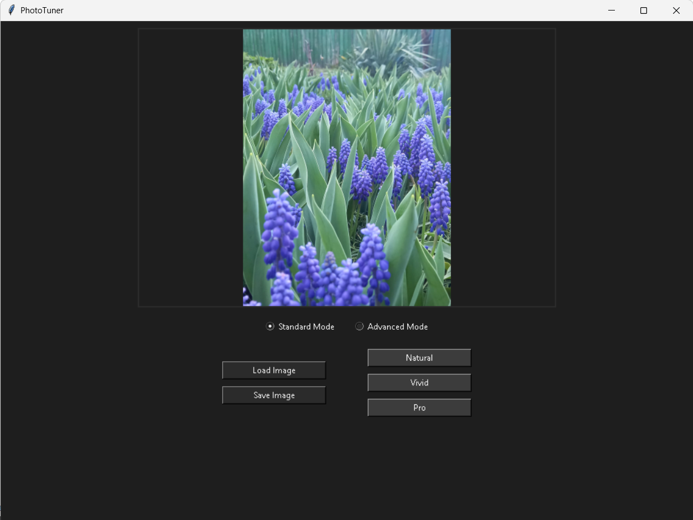
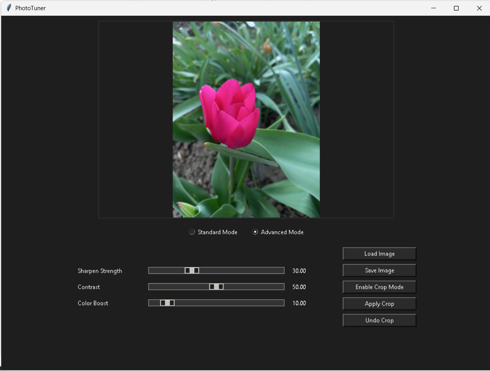

# PhotoTuner 

PhotoTuner is a image editing app built with Python and Tkinter that allows users to quickly enhance and crop their images. It offers both standard and advanced modes to easily adjust your photos using everything from simple style filters to fine-grained adjustments such as sharpness, contrast, and color enhancement.

## Features

- **Live Image Preview** with original aspect ratio
- **Advanced Mode**: Sharpen, Contrast, and Color Boost sliders
- **Standard Mode**: One-click filters (e.g., Natural, Vivid, Pro)
- **Crop Functionality** with visual markers
- **Aspect Ratio Preservation** for portrait and landscape images

### Portable Version

This project includes a portable `.exe` file built with `PyInstaller`.

1. Go to the `dist/` folder (included in the project).
2. Run `PhotoTuner.exe` directly — no Python required.  
   _Note: Windows might show a security warning when launching an unknown `.exe`. Just click **"More info" → "Run anyway"**._

## Technologies Used

- Python 3
- OpenCV (`opencv-python`)
- Pillow (`PIL`)
- Tkinter (standard Python GUI library)

## Preview 

## Author

Made by **Scarlat Alexandra Nicoleta**.